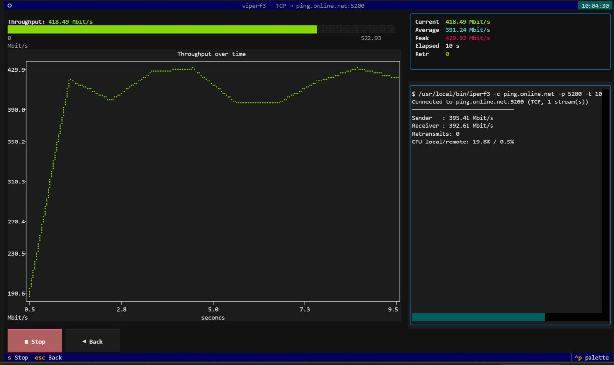

# viperf3

[](https://github.com/ilkz/viperf3/actions/workflows/ci.yml)
[](LICENSE)
[](https://www.python.org/downloads/)

A pseudo-graphical (TUI) shell over the **iperf3** client — visualise network
throughput as live charts and gauges, and configure the client from a simple form.

Built with [Textual](https://textual.textualize.io/).



## Features

- **Live throughput gauge** — auto-scaling bar showing the current speed.
- **Time-series chart** — throughput over the duration of the test.
- **Stats panel** — current / average / peak, plus TCP retransmits or UDP
  jitter & loss.
- **Configuration form** — host, port, duration (`-t`), parallel streams (`-P`),
  interval (`-i`), omit (`-O`), UDP mode, target bitrate (`-b`), reverse (`-R`),
  bidirectional (`--bidir`), TCP window (`-w`) and raw extra flags.
- **Presets** — save/load/delete named client configurations
  (stored in `~/.config/viperf3/presets.json`).
- Robust, version-tolerant parsing via iperf3's `--json-stream` (requires
  iperf3 **≥ 3.17**).

## Requirements

- Python **3.9+**
- **iperf3 ≥ 3.17** on `PATH` (or at `/usr/local/bin/iperf3`)

> [!IMPORTANT]
> **The `apt` package is too old.** Ubuntu 22.04 ships iperf3 **3.9**, which
> has no `--json-stream` and will not work with viperf3. Debian and other
> LTS distributions are usually in the same boat.
>
> Check what you have:
>
> ```bash
> iperf3 --version
> ```
>
> If it is below 3.17, build it from source:
>
> ```bash
> wget https://github.com/esnet/iperf/archive/refs/tags/3.17.1.tar.gz
> tar xzf 3.17.1.tar.gz && cd iperf-3.17.1
> ./configure && make -j"$(nproc)" && sudo make install && sudo ldconfig
> ```
>
> This installs to `/usr/local/bin/iperf3`, which viperf3 prefers over any
> older binary earlier on `PATH`.

## Install

```bash
python3 -m venv .venv
.venv/bin/pip install -e .
# make it available system-wide (no venv activation needed):
sudo ln -sf "$(pwd)/.venv/bin/viperf3" /usr/local/bin/viperf3
```

## Run

```bash
viperf3            # from anywhere
```

Fill in the server host/port and parameters, then press **Enter** (or the
**▶ Start test** button). Use **s** to stop, **Esc/b** to go back.

You need an iperf3 **server** to test against:

```bash
iperf3 -s            # on the remote host
```

## Standalone binary

Build a single self-contained executable (no Python required on the target):

```bash
.venv/bin/pip install pyinstaller   # plus: apt install libpython3.10
bash build_scripts/build_binary.sh  # → dist/viperf3 (~18 MB)
```

The target machine still needs **iperf3 ≥ 3.17** on `PATH` and a glibc at
least as new as the build machine's.

## Development

```bash
pip install -e '.[dev]'
pytest
```

The parser is covered by fixture-based tests (`viperf3/tests/fixtures/*.jsonl`)
so it can be validated without a running server.

## Architecture

| Module | Responsibility |
|--------|----------------|
| `models.py`  | Dataclasses for stream events (`Interval`, `StartInfo`, `Summary`). |
| `parser.py`  | Tolerant `--json-stream` line parser. |
| `config.py`  | `ClientConfig`, CLI argument builder, preset persistence. |
| `runner.py`  | Async subprocess runner streaming parsed events. |
| `widgets.py` | `SpeedGauge`, `StatsPanel`. |
| `screens.py` | `ConfigScreen`, `TestScreen`, preset modal. |
| `app.py`     | Textual `App` entry point. |

## Roadmap ideas

- Export results to CSV / JSON / PNG.
- Separate Down/Up charts for bidirectional tests.
- Run history and comparison overlay.
- Per-stream sparklines when using `-P N`.
- Server address book / quick re-run.
